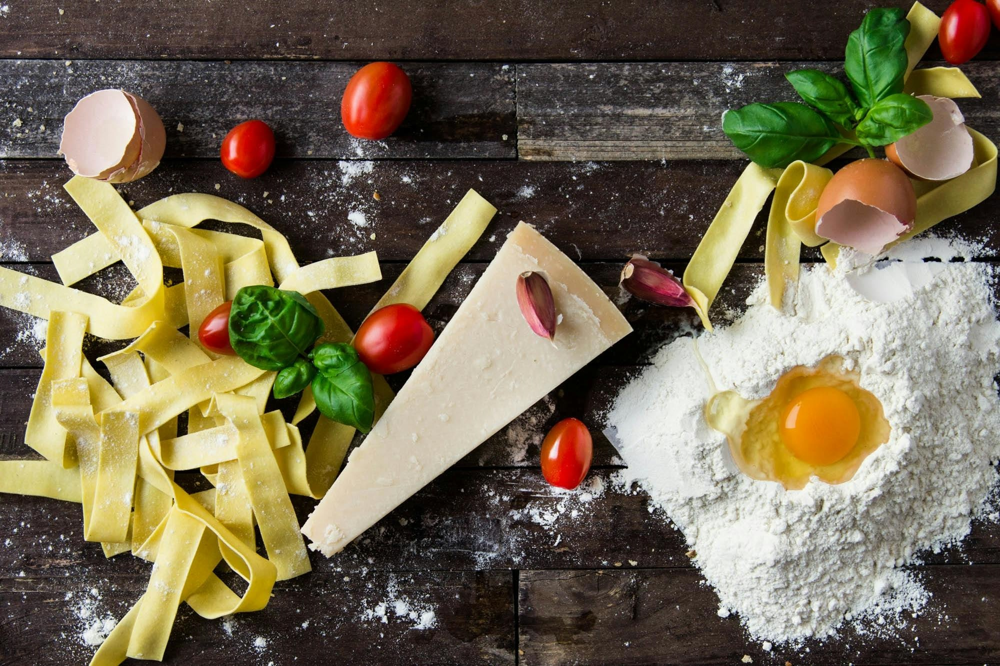

# An ***Italian*** Recipe making website

## Description
This website enables users to explore a variety of ***Italian*** recipes. Users have the flexibility to create, modify, and remove recipes from their account, and they can also contribute recipes from the site's collection. Moreover, users can engage with a community of fellow ***Italian*** food enthusiasts to share and discuss their passion for ***Italian*** cuisine.

This website is made using the following tech stack:
  1. **HTML**.
  2. **CSS**.
  3. **JavaScript**..

I encountered several hurdles while developing this website, particularly during the design phase. I found myself restructuring a significant portion of my code to adapt to necessary adjustments, particularly when optimizing for responsiveness. While initial reviews have made me believe it is a good design, I think I would prefer to work with a designer on any future project while I get better at web designs.

I would like to make all form and input fields to submit and be functional. And also, make the subscribe button prompt a modal of a form to subscribe to newsletters. 

## Features
This website has a gallery  that shows the best ***Italian*** recipes with little description, a detailed about us section of the company's description that includes it's product, recipes and support they have,
For this webpage, the user will be able to sign up and login, will have access to a dashboard. On the dashboard will be a list of all the recipes that have been created with an action to delete and edit recipes.
